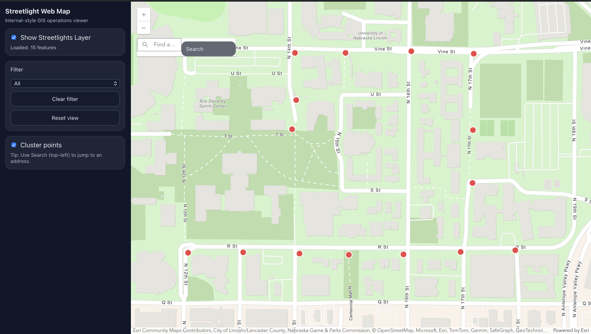

# Streetlight Web Map

Interactive web-based GIS application for viewing and filtering streetlight inspection data.

🔗 **Live Demo:**  
https://dylanmostek.github.io/streetlight-web-map/

---

## Overview

Streetlight Web Map is an internal-style GIS operations viewer built with the ArcGIS JavaScript API.  
It allows users to visualize streetlight inspection points, apply priority-based filters, and explore data through clustering and search.

---

## Features

- Interactive map with ArcGIS basemap
- Streetlight inspection FeatureLayer
- Priority-based filtering (High / Medium / Low)
- Dynamic feature counts
- Point clustering toggle
- Address search widget
- Deployed via GitHub Pages

---

## Screenshots

---

## Tech Stack

- JavaScript (ES Modules)
- Vite
- ArcGIS JavaScript API
- GitHub Pages

---

## Data Source

Streetlight inspection data served from an ArcGIS FeatureServer.

---

## Why This Project

This project demonstrates:
- Web GIS development
- Working with hosted feature services
- Client-side filtering and clustering
- Production deployment and asset handling for GitHub Pages
